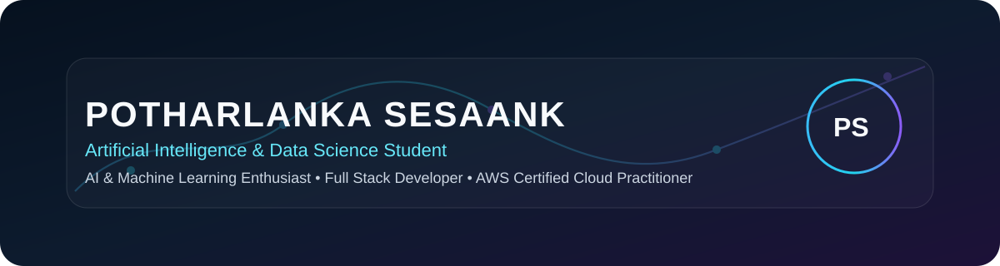

# Potharlanka Sesaank

  
  
  
  

  <strong>Artificial Intelligence & Data Science Student</strong> 
  <em>AI & Machine Learning Enthusiast | Full Stack Developer | AWS Certified Cloud Practitioner</em>

## About

I am pursuing a Bachelor of Technology in Artificial Intelligence & Data Science.

I am passionate about Artificial Intelligence, Machine Learning, Computer Vision, Data Science, and Full Stack Development.

I enjoy building intelligent software solutions that solve real-world problems.

I love learning modern technologies, contributing to projects, and continuously improving my programming and problem-solving skills.

## Focus Areas

- 🤖 AI & Machine Learning
- 🧠 Computer Vision
- 💻 Full Stack Development

## Tech Stack

### Programming
    

### Frontend
   

### Backend
 

### Artificial Intelligence
     

### Database
  

### Tools
    

### Cloud

## Projects

### Face Recognition Attendance System

An AI-powered attendance system using Python, OpenCV, DeepFace, Tkinter, and SQLite to automatically recognize students and record attendance.

- Repository: https://github.com/psesaank/FaceRecognitionAttendance
- Technologies: Python, OpenCV, DeepFace, Tkinter, SQLite

### Student Management System

A Java console-based application using JDBC and MySQL to manage student records with complete CRUD functionality.

- Repository: https://github.com/psesaank/StudentManagementSystem
- Technologies: Java, JDBC, MySQL

### 100 Days Challenge

A collection of coding challenges documenting my programming journey and continuous learning.

- Repository: https://github.com/psesaank/100-Days_challenge
- Technologies: Python, Problem Solving, DSA

## Certifications

- 🏆 AWS Certified Cloud Practitioner
- ☁️ AWS Certified Developer – Associate
- 🍃 MongoDB Associate Developer

## GitHub Stats

  

  

  

## Contact

Let&apos;s build something intelligent.

- GitHub: https://github.com/psesaank
- LinkedIn: https://www.linkedin.com/in/sesaank-potharlanka-702306320/
- Email: 2300080153@kluniversity.in
- Portfolio: https://sesaank-portfolio.vercel.app

---

Made with ❤️ by Potharlanka Sesaank

Artificial Intelligence & Data Science Student
